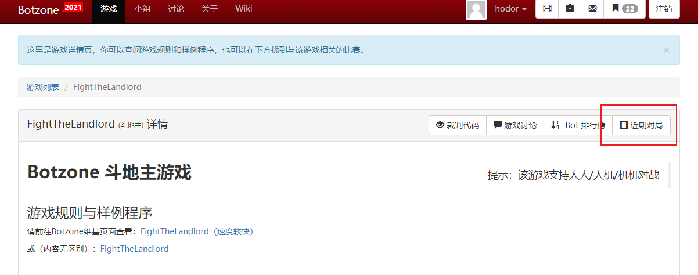
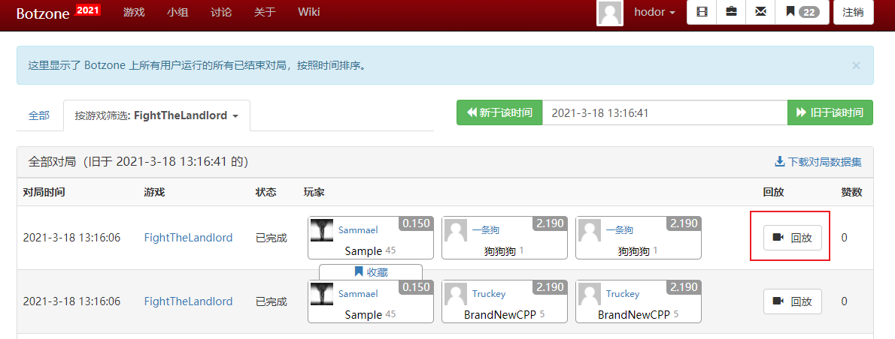
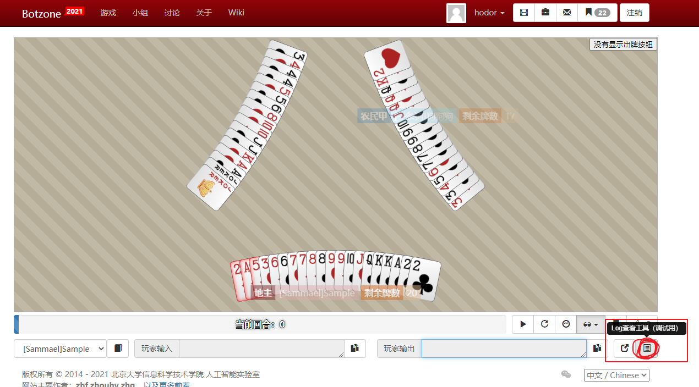
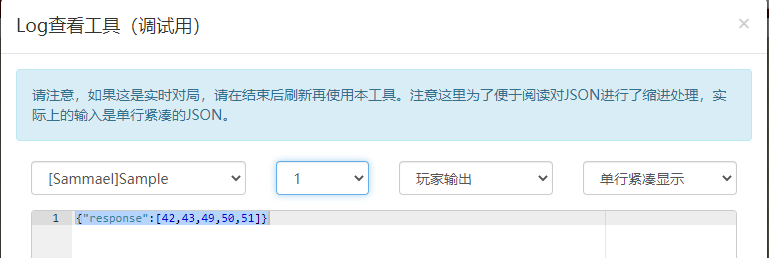

# 交互解读
为帮助同学们更好地理解bot与judge的交互，开展本地自博弈训练，我任选一次天梯对局为大家讲解交互流程，另附本地自博弈代码供参考

1、如何找到交互log

可以根据玩家、回合数、类别来查看log

2、交互流程(以伪代码形式给出):

**官方解释可参见
https://wiki.botzone.org.cn/index.php?title=Bot#.E4.BA.A4.E4.BA.92**

    初始化judge_input, bot_input
    while True:
        与judge交互
        If 返回指令是FINISH：
            跳出循环，本局游戏结束
        根据返回的指令修改judge_input和bot_input
        与bot交互
        根据返回的指令修改judge_input
